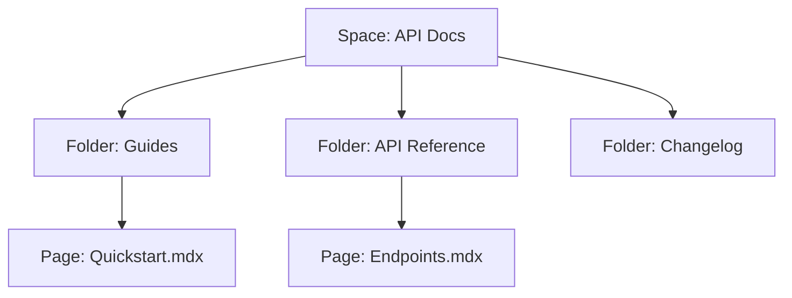

## Overview

ดีเจ Dinning provides robust core features for managing your project documentation effectively. You organize content hierarchically, collaborate seamlessly with teams, search efficiently, and export in multiple formats. These tools streamline your workflow from creation to sharing.

<Columns cols={2}>
  <Card title="Document Organization" icon="folder" href="#">
    Structure your docs with nested folders and pages for intuitive navigation.
  </Card>
  <Card title="Collaboration" icon="users" href="#">
    Edit together in real-time with version history and permissions.
  </Card>
  <Card title="Search & Navigation" icon="search" href="#">
    Find content instantly with full-text search and smart breadcrumbs.
  </Card>
  <Card title="Export Options" icon="download" href="#">
    Generate PDFs, HTML sites, or Markdown archives effortlessly.
  </Card>
</Columns>

## Document Organization and Structure

Organize your documentation using a tree-like structure. Create spaces, folders, and pages to mirror your project's architecture.

<Steps>
  <Step title="Create a Space" icon="plus">
    Start by creating a new space for your project.

    ```
    POST /api/spaces
    {
      "name": "ดีเจ Dinning API Docs",
      "description": "Documentation for the core API"
    }
    ```
  </Step>
  <Step title="Add Folders" icon="folder-plus">
    Nest folders for categories like `guides/`, `api/`, and `changelog/`.
  </Step>
  <Step title="Build Pages" icon="file-text">
    Add Markdown pages within folders for detailed content.
  </Step>
</Steps>



## Collaboration and Version Control

Collaborate with your team using real-time editing and Git-like version control. Track changes, revert updates, and assign permissions.

<Tabs>
  <Tab title="Team Editor" icon="edit-3">
    Multiple users edit simultaneously. Changes sync instantly.
  </Tab>
  <Tab title="Version History" icon="git-branch">
    View diffs and restore previous versions.

    <CodeGroup tabs="CLI,REST">
      ```bash
      djctl versions list --space "API Docs"
      djctl versions revert --space "API Docs" --version v1.2.0
      ```
      ```javascript
      await djClient.versions.list({ space: 'API Docs' });
      await djClient.versions.revert({ space: 'API Docs', version: 'v1.2.0' });
      ```
    </CodeGroup>
  </Tab>
</Tabs>

<Callout kind="tip">
  Use role-based access: `admin`, `editor`, `viewer` to control contributions.
</Callout>

## Search, Navigation, and Export Options

Search across all documents with full-text indexing. Navigate via sidebar tree or breadcrumbs. Export your entire space for offline use.

| Export Type | Format | Use Case |
|-------------|--------|----------|
| PDF | Single file | Printing, sharing reports |
| HTML | Static site | Hosting on GitHub Pages |
| Markdown | ZIP archive | Migration to other tools |
| JSON | Structured data | API integrations |

<Expandable title="Advanced Export Configuration" default-open="false">

Customize exports with themes and filters.

```
{
  "format": "html",
  "theme": "default",
  "includePrivate": false,
  "pages": ["guides/*", "api/endpoints"]
}
```

</Expandable>

These features empower you to maintain professional, scalable documentation for ดีเจ Dinning projects.