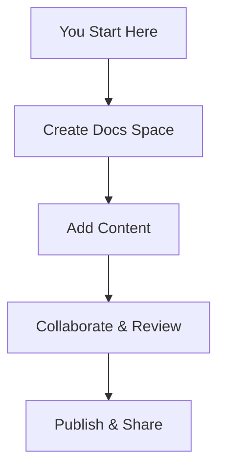

## Overview

ดีเจ Dinning Documentation provides a centralized hub where you organize, collaborate on, and publish project documentation. You create structured spaces for technical guides, API references, and onboarding materials. The platform supports real-time editing, version control, and seamless integrations with tools like GitHub and Slack.

This space serves as your default documentation area. You manage all project-related content here, from quickstarts to advanced troubleshooting.



## Key Benefits for Teams

ดีเจ Dinning Documentation streamlines your workflow with powerful features tailored for development teams, product managers, and support staff.

<Columns cols={3}>
  <Card title="Collaborative Editing" icon="users" href="/docs/collaboration">
    Multiple team members edit simultaneously with live previews and change tracking.
  </Card>
  <Card title="Version Control" icon="git-branch" href="/docs/versions">
    Track changes, revert updates, and maintain history without external tools.
  </Card>
  <Card title="Customizable Themes" icon="palette" href="/docs/themes">
    Apply your brand colors like `#3B82F6` for a professional look.
  </Card>
</Columns>

<Callout kind="tip">
  Start small: Begin with a single page and expand as your project grows.
</Callout>

## Quick Start Steps

Follow these steps to set up your first documentation space.

<Steps>
  <Step title="Create Account" icon="user-plus">
    Sign up at `https://app.djedinning.com` using your email or GitHub account.
  </Step>
  <Step title="New Space" icon="plus">
    Click **New Space** and name it after your project, like `MyApp Docs`.
  </Step>
  <Step title="Add Pages" icon="file-plus">
    Create pages for overview, API, and FAQs. Use the MDX editor for rich content.
  </Step>
  <Step title="Invite Team" icon="mail">
    Share the space link and add collaborators via email.
  </Step>
</Steps>

## Platform-Specific Setup

Customize your setup based on your development environment.

<Tabs>
  <Tab title="Node.js" icon="nodejs">
    Install the CLI for local editing:

    <CodeGroup tabs="npm,yarn">
```bash
npm install -g @djedinning/cli
```
```bash
yarn global add @djedinning/cli
```
    </CodeGroup>

    Initialize your space:

    ```bash
    djedinning init my-docs
    ```
  </Tab>
  <Tab title="Python" icon="python">
    Use the Python SDK for automation:

    ```python
    pip install djedinning-sdk
    client = DjeClient(api_key="YOUR_API_KEY")
    client.create_space("MyProject")
    ```
  </Tab>
</Tabs>

## Brand Guidelines

Follow these guidelines to maintain consistency across your documentation.

<ExpandableGroup>
  <Expandable title="Primary Color" default-open="true">
    Use `#3B82F6` as your primary brand color for headings and accents. Avoid variations lighter than `#60A5FA`.
  </Expandable>
  <Expandable title="Typography">
    Headings: Inter font, bold weights. Body: 16px base size for readability.
  </Expandable>
  <Expandable title="Logo Usage">
    Download the SVG logo from `/assets/logo.svg`. Scale to fit without distortion.
  </Expandable>
</ExpandableGroup>

## Support Resources

Access these resources to get help quickly.

| Resource | Description | Link |
|----------|-------------|------|
| Help Center | Searchable articles and FAQs | `/help` |
| Community Forum | Ask questions and share tips | `https://forum.djedinning.com` |
| API Reference | Full API documentation | `/api` |
| Contact Support | Submit tickets for issues | `support@djedinning.com` |

You now have everything to build effective documentation. Explore the sidebar for detailed guides.